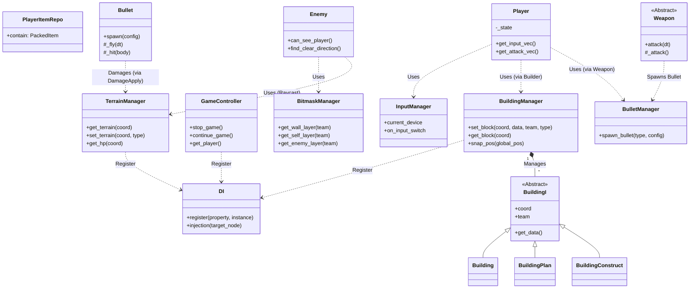

# 項目架構文檔 (Architecture)

本文檔詳細說明 Miningame 的代碼架構與設計模式。

## 1. 系統類圖 (UML)

## 2. 核心系統 (Core)

核心系統位於 `Core/` 目錄，提供遊戲運行的基礎服務。並通過 `Autoload` (單例) 全局訪問。

### 1.1 依賴注入 (DI)
- **路徑**: `Core/DI/DI.gd`
- **功能**: 管理遊戲內的依賴關係，解耦各個系統。
- **使用**: 通過 `DI` 全局變量訪問。

### 1.2 輸入管理 (InputManager)
- **路徑**: `Core/InputManager/InputManager.gd`
- **功能**: 統一處理玩家輸入，支持鍵盤與手柄。
- **配置**: 輸入映射定義在 `project.godot` 的 `[input]` 區塊。

### 1.3 工具類 (Utility)
- **路徑**: `Core/Utility.gd`
- **功能**: 提供通用的輔助函數。

## 2. 遊戲系統 (GameSystem)

遊戲系統位於 `GameSystem/` 目錄，負責具體的遊戲邏輯。

### 2.1 核心玩法系統
- **GameController (`GameSystem/GameController/game_controller.gd`)**:
	- 遊戲總控，負責初始化流程 (`_game_start` 遞歸調用)。
	- 管理遊戲時間速率 (`time_scale`) 與暫停/繼續。
	- 提供獲取玩家實體的全局接口。
- **TerrainManager (`GameSystem/TerrainManager/TerrainManager.gd`)**:
	- 管理地圖網格與地形類型 (WALL, AIR)。
	- 維護地形生命值 (`_hp_map`)，處理挖掘與破壞邏輯。
	- 提供坐標轉換功能 (`global_to_coord`)。
- **BuildingManager (`GameSystem/BuildingManager/building_manager.gd`)**:
	- 負責建築的放置、預覽 (Plan)、建造 (Construct) 與完成 (Building) 狀態切換。
	- 處理網格對齊 (`snap_pos`, `coord_to_global`) 與空間佔用檢測。
	- 管理所有建築實體的生命週期。

### 2.2 資源與狀態系統
- **PlayerItemRepo (`GameSystem/PlayerItemRepo/player_item_repo.gd`)**:
	- 管理玩家的物品庫存，使用 `PackedItem` 存儲資源。
- **BitmaskManager (`GameSystem/BitmaskManager/bitmask_manager.gd`)**:
	- 集中管理物理層與碰撞掩碼。
	- 定義隊伍 (PLAYER, ENEMY) 與對應的物理層 (WALL_LAYER, PLAYER_LAYER, ENEMY_LAYER)。
	- 提供獲取敵/我方 Layer 的輔助函數，用於射線檢測與碰撞過濾。

### 2.3 視聽特效系統
- **LightManager (`GameSystem/LightManager/LightManager.gd`)**:
	- 管理遊戲內的光照系統。
	- 提供 `create_light()` 接口生成光源。
	- 維護全局光照多邊形 (`LightPolygon`)。
- **ParticleManager (`GameSystem/ParticleManager/particle_manager.gd`)**:
	- 粒子特效工廠。
	- 提供 `create()` 接口生成指定類型的粒子 (如 SPARK) 並自動管理銷毀。
- **SoundPlayer (`GameSystem/SoundPlayer/SoundPlayer.gd`)**:
	- 音效播放管理器。
	- 支持 2D 空間音效 (`play_sound`) 與 UI 音效 (`play_ui_sound`)。

### 2.4 戰鬥支持系統
- **BulletManager (`GameSystem/BulletManager/bullet_manager.gd`)**:
	- 子彈生成工廠。
	- 根據 `BulletConfig` 與類型生成子彈實體。

## 3. 實體架構 (Entity)

實體位於 `Entity/` 目錄，採用組合模式 (Composition) 與繼承。

### 3.1 通用組件 (_components)
位於 `Entity/_components/`，提供跨實體復用的邏輯。
- **DamageApply**: 傷害輸出組件。負責查找目標身上的 `DamageTaker` 並造成傷害，同時處理對地形的破壞 (通過 `TerrainManager`) 與特效生成。
- **DamageTaker**: 傷害接收組件。管理實體生命值 (`_hp`)，處理受傷 (`damage`) 與死亡 (`_die` -> `queue_free`)。

### 3.2 玩家 (Player)
- **路徑**: `Entity/Player/player.gd`
- **核心**: 繼承自 `Node2D` (內部包含 `CharacterBody2D`)。
- **功能**:
	- **移動**: 基於加速度/減速度的平滑移動，支持衝刺 (Dash) 狀態。
	- **輸入**: 通過 `InputManager` 與 `Input.get_vector` 獲取移動指令。
	- **戰鬥**: 集成 `AimController` 處理瞄準，`Builder` 處理建造。
	- **依賴**: 注入 `_player` 到 DI 系統，使用 `LightManager` 生成光源。

### 3.3 敵人 (Enemy)
- **路徑**: `Entity/Enemy/Zako/zako.gd` (示例)
- **核心**: 繼承自 `CharacterBody2D`。
- **AI 邏輯**:
	- **感知**: `can_see_player()` 使用射線檢測玩家可見性。
	- **尋路**: `find_clear_direction()` 掃描周圍牆壁距離，尋找開闊路徑。
	- **移動**: 類似玩家的平滑加速移動邏輯。

### 3.4 建築 (Building)
- **基類**: `Entity/Building/BuildingI.gd` (抽象基類)。
- **數據**: 使用 `BuildingData` 存儲配置。
- **狀態**: 維護 `coord` (網格坐標), `team` (所屬隊伍)。
- **功能**:
	- `get_global_rect()`: 獲取建築佔用的物理區域。
	- 初始化時自動註冊到 `IFF` (敵我識別) 並顯示調試信息。

### 3.5 戰鬥系統 (Weapon & Bullet)
- **Weapon (`Entity/Weapon/weapon.gd`)**:
	- 抽象基類，子類需實現 `_attack()`。
	- 處理攻擊冷卻 (`fire_cd`) 與輸入檢測。
	- 自動處理武器旋轉與貼圖翻轉 (基於瞄準方向)。
- **Bullet (`Entity/Bullet/Bullet.gd`)**:
	- `CharacterBody2D` 驅動的投射物。
	- `_fly()`: 直線飛行邏輯。
	- `_hit()`: 碰撞檢測，調用 `DamageApply` 造成傷害。
	- 集成光源效果。

### 3.6 物品系統 (Item)
- **PackedItem (`Entity/Item/PackedItem.gd`)**:
	- 核心資源類，繼承自 `Resource`。
	- `item_set`: `Dictionary[Item.ITEM, float]` 存儲多種物品及其數量。
	- **運算**: 支持資源包之間的加減乘除 (`add`, `sub`, `mul`, `div`) 與向量運算 (`vmin`, `vmax`, `vclamp`)，便於處理資源轉換與傳輸邏輯。

## 4. 物理層 (Physics Layers)

在 `project.godot` 中定義了以下物理層：
- Layer 1: Wall (牆壁/地形)
- Layer 2: Player (玩家)
- Layer 5: Enemy (敵人)

## 5. 資源管理

- **Asset/** 目錄存放所有靜態資源。
- `project.godot` 中的 `folder_colors` 設置了目錄顏色以便於在編輯器中識別。

## 6. 結構性矛盾與優化分析 (Structural Analysis)

本章節分析項目中存在的結構性矛盾、潛在風險與優化建議。

### 6.1 依賴注入 (DI) 系統的脆弱性
- **問題**: `DI.gd` 使用字符串 (String) 作為鍵值 (`_dependence[property]`)，屬於 "Stringly-typed"。
- **風險**: 容易因拼寫錯誤導致運行時崩潰，且 IDE 無法提供自動補全或靜態檢查。
- **建議**: 建立一個 `DIKeys` 常量類或枚舉，統一管理所有依賴的鍵名。

### 6.2 Manager 與 Entity 的緊密耦合
- **問題**: `BuildingI` (實體基類) 直接調用 `BuildingManager` 的靜態方法 (`coord_to_global`, `BLOCK_SIZE`)。
- **風險**: 
	- **循環依賴**: `BuildingManager` 管理 `BuildingI`，而 `BuildingI` 又依賴 `BuildingManager` 的實現細節。
	- **難以測試**: 無法在不加載 `BuildingManager` 的情況下單獨測試 `Building` 邏輯。
- **建議**: 將坐標轉換邏輯剝離為純靜態工具類 (如 `GridUtils`)，或通過 DI 將 `GridSystem` 注入給 `Building`。

### 6.3 全局狀態管理的隱患
- **問題**: `PlayerItemRepo` 作為單例直接暴露 `contain` (PackedItem) 屬性。
- **風險**: 任何系統都可以隨意修改玩家庫存，缺乏統一的接口 (如 `add_item`, `remove_item`) 來觸發事件或驗證邏輯。這會導致狀態變化難以追蹤。
- **建議**: 封裝 `PlayerItemRepo` 的數據訪問，僅通過方法修改庫存，並發送 `on_inventory_changed` 信號。

### 6.4 GameController 的職責過重
- **問題**: `GameController` 使用 `_recursive_call` 遍歷場景樹來觸發 `_game_start`。
- **風險**: 這種隱式的初始化流程依賴於節點樹結構，且 `await` 可能導致不可預測的初始化順序 (Race Condition)。
- **建議**: 使用 Godot 的 `Group` 系統來管理需要初始化的對象，或建立明確的初始化隊列。

### 6.5 硬編碼與魔法數字
- **問題**: `project.godot` 與部分代碼中存在硬編碼路徑 (如 `uid://...`) 與數值。
- **風險**: 資源移動或重構時容易斷鏈。
- **建議**: 盡量使用 `export` 變量或配置文件管理資源路徑與常量。
