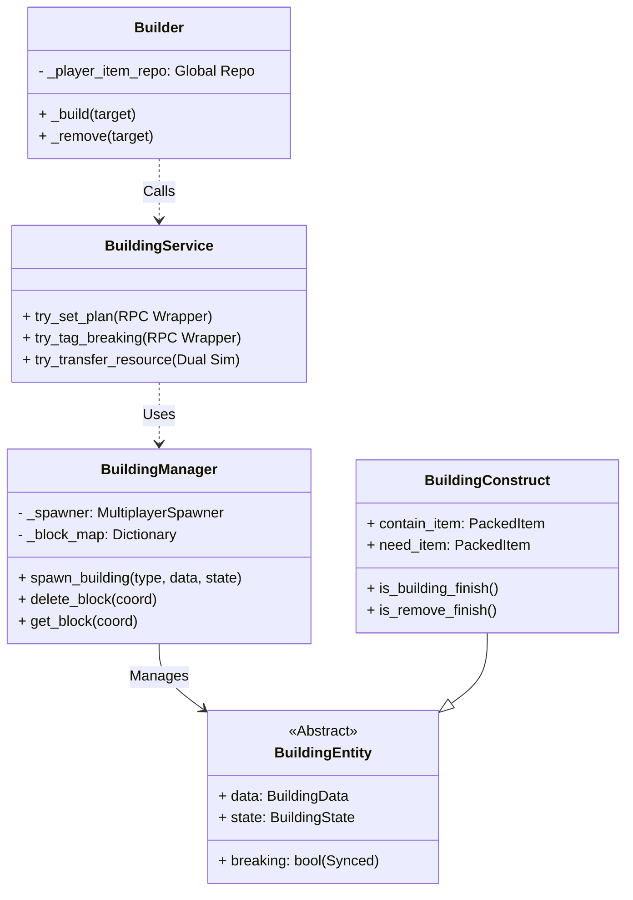

# Building System Specification (建築系統規格書)

## 1. 系統概述 (System Overview)
本系統負責遊戲中的建築建造、升級、拆除以及資源傳遞邏輯。
在多人連線架構下，採用 **Strict Server Authority (Server 權威)** 搭配 **Dual Simulation (雙端模擬)** 的混合模式，以確保資料一致性並維持良好的客戶端響應體驗。

---

## 2. 核心架構 (Core Architecture)

系統主要由三大組件構成：
1.  **BuildingManager**: 負責建築的生命週期管理、生成的註冊 (Registry) 與網路同步 (Spawner)。
2.  **BuildingService**: 提供高層級操作 API (RPC 介面)，處理客戶端請求與 Server 驗證。
3.  **Builder (組件)**: 附著於玩家或單位上，負責執行實際的建造/拆除行為 (資源傳輸)。

### 類別關係圖

---

## 3. 多人同步機制 (Synchronization Strategy)

### 3.1 結構同步 (Structure Sync)
*   **機制**: `MultiplayerSpawner`
*   **權威**: Server Only
*   **說明**: 所有的建築生成 (`spawn_building`) 與刪除 (`delete_block`) 僅能在 Server 端執行。`MultiplayerSpawner` 會自動將節點的增刪同步給所有 Client。

### 3.2 狀態同步 (State Sync)
*   **機制**: `MultiplayerSynchronizer`
*   **屬性**: `:breaking` (Boolean)
*   **模式**: `On Change`
*   **說明**: 當建築被標記為「拆除中」(`request_tag_breaking`) 時，Server 設定 `breaking = true`，透過同步器廣播給 Client。Client 收到後，其 `Builder` 才會切換至拆除邏輯。

### 3.3 邏輯同步 (Logic Sync - Dual Simulation)
*   **機制**: `BuildingService.try_transfer_resource()`
*   **說明**: 資源的傳遞 (Builder -> Building) 不使用頻繁的網路同步，而是採用「雙端模擬」：
    1.  **Client**: `Builder` 計算傳輸量 -> 本地扣除背包/增加建築資源 -> 更新 UI 進度條。
    2.  **Server**: `Builder` 執行相同邏輯 -> 驗證並修改權威數據。
    3.  **校正**: 僅在建築完成 (`BuildingFinish`) 或拆除完成 (`RemoveFinish`) 等關鍵節點，Server 會發送最終狀態或生成新物件來「覆蓋」Client 的模擬結果。

---

## 4. 關鍵流程 (Key Workflows)

### 4.1 建造流程 (Construction Flow)
1.  **放置藍圖**:
    *   Client `Placer` 呼叫 `BuildingService.try_set_plan()`。
    *   Server `request_build_plan` 驗證位置 -> `BuildingManager.spawn_building(PLAN)`。
    *   Spawner 同步 `BuildingPlan` 到 Client。
2.  **升級/建造**:
    *   Server `Builder` 偵測到 `BuildingPlan` -> `try_upgrade` -> 替換為 `BuildingConstruct`。
    *   Client/Server `Builder` 對 `BuildingConstruct` 執行 `try_transfer_resource` (注入資源)。
    *   **完成判定 (Server)**: `is_building_finish()` 為真 -> `request_upgrade` -> 替換為 `Building` (完成體)。

### 4.2 拆除流程 (Deletion Flow)
1.  **標記拆除**:
    *   Client `Remover` 呼叫 `BuildingService.try_tag_breaking()`。
    *   Server `request_tag_breaking` -> 設定 `building.breaking = true`。
    *   `MultiplayerSynchronizer` 同步 `breaking` 狀態給 Client。
2.  **回收資源**:
    *   Client/Server `Builder` 偵測到 `breaking == true` -> 切換至 `_remove` 模式。
    *   `try_transfer_resource` (雙端模擬) 將資源從建築退回背包。
3.  **刪除判定 (Server)**:
    *   **條件**: `is_remove_finish()` (資源歸零 且 breaking)。
    *   **執行**: `request_delete` -> `BuildingManager.delete_block()` -> `queue_free()`。
    *   Spawner 自動同步刪除結果。

---

## 5. 特殊類型說明

### FULL_REMOVED_CONSTRUCT
*   **用途**: 當玩家對一個已完成的 `Building` 進行拆除時，無法直接變回「一半的鷹架」。
*   **機制**:
    *   Server 刪除 `Building`。
    *   Server 生成 `FULL_REMOVED_CONSTRUCT` (這是一個 `BuildingConstruct` 變體)。
    *   **初始化**: 自動設定 `breaking = true` 且 `contain_item = full`。
    *   Client 生成此物件時，亦會執行相同初始化，確保視覺上立即顯示為「滿資源且正在拆除」的鷹架。

---

## 6. API 參考 (BuildingService)

| 函式 | 權限 | 用途 |
| :--- | :--- | :--- |
| `try_set_plan(coord, ...)` | Client/Server | 請求放置藍圖 (RPC to Server) |
| `try_tag_breaking(coord)` | Client/Server | 請求標記拆除 (RPC to Server) |
| `try_transfer_resource(...)` | Local (Dual) | 執行資源轉移 (不走 RPC) |
| `request_build_plan(...)` | Server Only | (RPC) 執行藍圖生成 |
| `request_tag_breaking(...)` | Server Only | (RPC) 執行拆除標記 |
| `request_delete(...)` | Server Only | (RPC) 執行刪除 |
